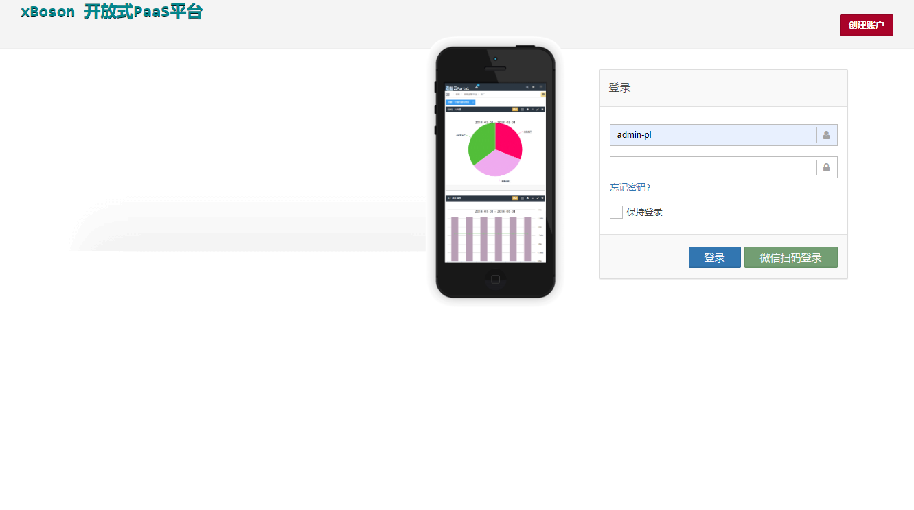
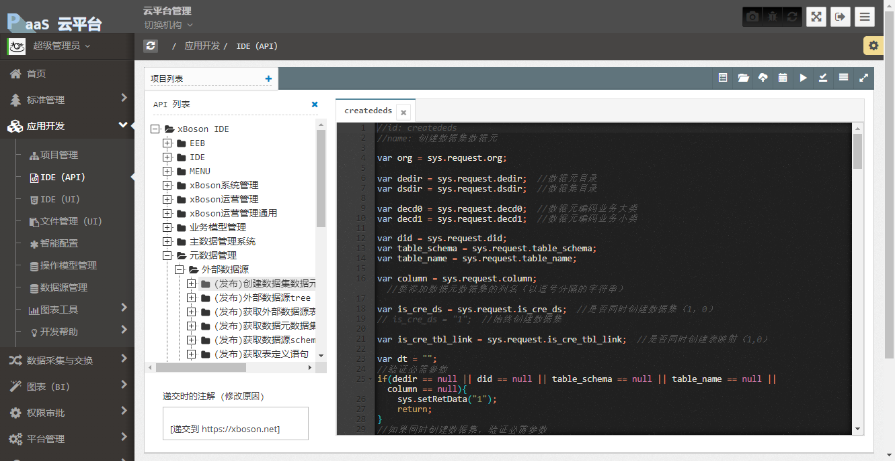

# xBoson 平台前端

所以平台基础应用的画面文件.  
平台开发指南文档.

该项目由 [上海竹呗信息技术有限公司](https://xboson.net/) 提供技术支持.

## 主目录说明

* `public` 所有前端文件
* `shell-script` 外壳脚本目录
* `xboson-node-modules` 脚本扩展目录
* `webservice` WSDL 测试客户端

## 工具脚本

* dump-web-all.cmd -- 打包 WEB 数据, 输出到 web4xboson-all.tar.gz.
* dump-web-all.sh  -- For bash

## 前端文件简要说明

* public/docx - 上传非文本文档保存目录
* public/lib - 保存头像能功能性文件上传目录
* public/masquerade - masquerade模板库目录
* public/web - 非业务文件存储目录
* public/web/wiki-api - 开发指南, 包括平台核心API/前端开发方法/各个边缘节点的接入方法
* public/web/cdn - 第三方js库统一保存目录, 在其他目录中保存这个文件是不推荐的, 那些文件在后续版本中将被删除
* public/ui - 生产环境目录, 是 public/t 目录的复制.
* public/t - 开发环境目录.
* public/t/saas - 改目录中, 每个机构有自己的根目录, 目录名是机构ID.
* public/t/saas/61a9ba99b94a4325ac747b4a9263df68 - 一个测试用的机构.
* public/t/paas - 平台核心应用目录, 平台机构目录
* public/t/paas/mdms/datadictD - 值域代码应用
* public/t/paas/md/mmD - 元数据管理
* public/t/paas/bm/bms - 多维模型
* public/t/paas/rbac/prj_mgt - 项目管理
* public/t/paas/ide - 接口开发/前端开发IDE
* public/t/paas/ide/uipublish - 文件发布, 把/t/中的文件上线到/ui/
* public/t/paas/mgt/datasource - 接口数据源
* public/t/paas/ws/api/v - Api目录服务
* public/t/paas/datas/webservice - Webservice 服务列表
* public/t/paas/pivot_table/ - 数据透视
* public/t/paas/flow-diagram - 流程图
* public/t/paas/menu - 动态菜单管理
* public/t/paas/rbac - 权限管理, 人员/角色/客户端
* public/t/paas/bi/log - 日志分析
* public/t/paas/schedule/schedule_manage - 计划任务
* public/t/paas/mgt/pm - 进程管理/集群管理
* public/t/paas/blockchain - 区块链管理/见证者管理, 波子币DEMO
* public/t/paas/iot - 物联网
* public/t/paas/opcserver - OPC节点管理器
* public/t/paas/modern-ui - 大屏DEMO
* public/t/paas/graph - 知识库管理
* public/t/paas/code-less - 低代码开发IDE, 该项目没有上线只能以 /t/ 前缀打开.

## 其他

* [xBoson平台运算核心](https://github.com/yanmingsohu/xBoson-core)
* [xBoson最小系统实施](https://github.com/yanmingsohu/xBoson-deploy)
* [mxGraph](https://jgraph.github.io/mxgraph/)
* [Vue2](https://v2.vuejs.org/)
* [WebPivotTable](https://webpivottable.com/)